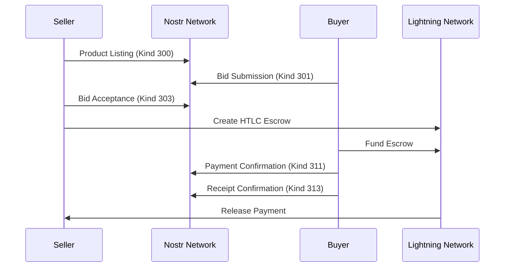

# DOMP Developer Integration Guide

Complete guide for integrating DOMP (Decentralized Online Marketplace Protocol) into applications and building on the protocol.

## Table of Contents

- [Quick Start](#quick-start)
- [Protocol Architecture](#protocol-architecture)
- [Core Components](#core-components)
- [Building Your First DOMP App](#building-your-first-domp-app)
- [Advanced Integration](#advanced-integration)
- [Protocol Extensions](#protocol-extensions)
- [Best Practices](#best-practices)
- [Troubleshooting](#troubleshooting)

## Quick Start

### Prerequisites

- Python 3.8+ or Node.js 16+
- Basic understanding of Bitcoin Lightning Network
- Familiarity with Nostr protocol concepts
- Development environment with Git

### 5-Minute Demo

```bash
# Clone the repository
git clone <repository-url>
cd fromperdomp-poc/implementations/reference/python

# Setup environment
python3 -m venv domp-env
source domp-env/bin/activate
pip install fastapi uvicorn websockets secp256k1 pydantic

# Run the demo
python3 web_api.py
# Visit http://localhost:8080
```

## Protocol Architecture

### Layer Overview

```
┌─────────────────────────────────────┐
│         Application Layer           │  ← Your App
├─────────────────────────────────────┤
│         DOMP Protocol Layer         │  ← Events, Validation
├─────────────────────────────────────┤
│      Lightning Escrow Layer         │  ← HTLC, Payments
├─────────────────────────────────────┤
│       Reputation Layer              │  ← Scoring, Trust
├─────────────────────────────────────┤
│         Network Layer               │  ← Nostr Relays
└─────────────────────────────────────┘
```

### Event Flow



## Core Components

### 1. Cryptographic Identity

Every DOMP participant needs a secp256k1 keypair:

```python
from domp.crypto import KeyPair

# Generate new identity
keypair = KeyPair()

# Load existing identity
keypair = KeyPair(private_key=bytes.fromhex("your_private_key"))

# Access public key
pubkey = keypair.public_key_hex
```

### 2. Event Creation and Signing

All DOMP events must be cryptographically signed:

```python
from domp.events import ProductListing

# Create a product listing
listing = ProductListing(
    product_name="Digital Camera",
    description="Professional DSLR camera in excellent condition",
    price_satoshis=75_000_000,  # 0.75 BTC
    category="electronics",
    seller_collateral_satoshis=7_500_000,  # 10% collateral
    listing_id="unique_listing_id"
)

# Sign the event
listing.sign(keypair)

# Convert to dict for transmission
event_dict = listing.to_dict()
```

### 3. Event Validation

Always validate incoming events:

```python
from domp.validation import validate_event

# Validate event structure and signature
is_valid = validate_event(event_dict)

if is_valid:
    # Process the event
    process_listing(event_dict)
else:
    # Reject invalid event
    logger.warning(f"Invalid event: {event_dict['id']}")
```

### 4. Lightning Escrow Integration

```python
from domp.lightning import LightningEscrowManager

escrow_manager = LightningEscrowManager()

# Create escrow for transaction
escrow = escrow_manager.create_escrow(
    transaction_id="tx_12345",
    buyer_pubkey=buyer_keypair.public_key_hex,
    seller_pubkey=seller_keypair.public_key_hex,
    purchase_amount_sats=75_000_000,
    buyer_collateral_sats=75_000_000,
    seller_collateral_sats=7_500_000
)

# Check escrow status
if escrow.state == EscrowState.FUNDED:
    # Both parties have funded, proceed with transaction
    proceed_with_delivery()
```

### 5. Reputation Tracking

```python
from domp.reputation import ReputationSystem, ReputationScore

reputation_system = ReputationSystem()

# Create reputation score from completed transaction
score = ReputationScore(
    transaction_id="tx_12345",
    reviewer_pubkey=buyer_keypair.public_key_hex,
    reviewed_pubkey=seller_keypair.public_key_hex,
    overall_rating=5,
    item_quality=5,
    shipping_speed=4,
    communication=5,
    payment_reliability=5,
    transaction_amount_sats=75_000_000,
    verified_purchase=True,
    escrow_completed=True
)

reputation_system.add_reputation_score(score)

# Get seller reputation summary
summary = reputation_system.get_reputation_summary(seller_pubkey)
trust_score = reputation_system.get_trust_score(seller_pubkey)
```

## Building Your First DOMP App

### Simple Marketplace Browser

```python
#!/usr/bin/env python3
"""
Simple DOMP marketplace browser
"""

import json
from domp.crypto import KeyPair
from domp.events import ProductListing
from domp.validation import validate_event

class SimpleDOMPBrowser:
    def __init__(self):
        self.keypair = KeyPair()
        self.listings = {}
    
    def add_listing(self, event_dict):
        """Add a validated listing to our local store"""
        if not validate_event(event_dict):
            return False
        
        if event_dict['kind'] == 300:  # Product Listing
            content = json.loads(event_dict['content'])
            self.listings[event_dict['id']] = {
                'event': event_dict,
                'content': content
            }
            return True
        return False
    
    def browse_listings(self):
        """Display all available listings"""
        print("🛒 Available Listings:")
        print("-" * 50)
        
        for listing_id, data in self.listings.items():
            content = data['content']
            event = data['event']
            
            print(f"📦 {content['product_name']}")
            print(f"   Price: {content['price_satoshis']:,} sats")
            print(f"   Category: {content.get('category', 'general')}")
            print(f"   Seller: {event['pubkey'][:16]}...")
            print(f"   Description: {content['description'][:100]}...")
            print()
    
    def create_listing(self, product_name, description, price_sats, category="general"):
        """Create a new product listing"""
        listing = ProductListing(
            product_name=product_name,
            description=description,
            price_satoshis=price_sats,
            category=category,
            seller_collateral_satoshis=price_sats // 10,  # 10% collateral
            listing_id=f"item_{int(time.time())}"
        )
        
        listing.sign(self.keypair)
        event_dict = listing.to_dict()
        
        # Add to our local store
        self.add_listing(event_dict)
        
        return event_dict

# Usage example
if __name__ == "__main__":
    browser = SimpleDOMPBrowser()
    
    # Create some sample listings
    browser.create_listing(
        "Vintage Guitar",
        "1970s Fender Stratocaster in excellent condition",
        50_000_000,  # 0.5 BTC
        "music"
    )
    
    browser.create_listing(
        "Programming Book",
        "Clean Code by Robert Martin, barely used",
        2_000_000,  # 0.02 BTC
        "books"
    )
    
    # Browse listings
    browser.browse_listings()
```

### Web API Integration

```python
from fastapi import FastAPI, HTTPException
from domp.crypto import KeyPair
from domp.events import ProductListing, BidSubmission

app = FastAPI()

# Global state (use proper database in production)
keypair = KeyPair()
listings = {}
bids = {}

@app.get("/listings")
async def get_listings():
    """Get all marketplace listings"""
    return {"listings": list(listings.values())}

@app.post("/listings")
async def create_listing(
    product_name: str,
    description: str, 
    price_sats: int,
    category: str = "general"
):
    """Create a new product listing"""
    listing = ProductListing(
        product_name=product_name,
        description=description,
        price_satoshis=price_sats,
        category=category,
        seller_collateral_satoshis=price_sats // 10,
        listing_id=f"listing_{len(listings)}"
    )
    
    listing.sign(keypair)
    event_dict = listing.to_dict()
    
    listings[listing.id] = event_dict
    
    return {
        "success": True,
        "listing_id": listing.id,
        "event": event_dict
    }

@app.post("/bids")
async def place_bid(
    listing_id: str,
    bid_amount_sats: int,
    message: str = ""
):
    """Place a bid on a listing"""
    if listing_id not in listings:
        raise HTTPException(status_code=404, detail="Listing not found")
    
    bid = BidSubmission(
        product_ref=listing_id,
        bid_amount_satoshis=bid_amount_sats,
        buyer_collateral_satoshis=bid_amount_sats,
        message=message,
        payment_timeout_hours=24
    )
    
    bid.sign(keypair)
    event_dict = bid.to_dict()
    
    bids[bid.id] = event_dict
    
    return {
        "success": True,
        "bid_id": bid.id,
        "event": event_dict
    }
```

### JavaScript/TypeScript Integration

```typescript
// DOMP TypeScript types
interface DOMPEvent {
  id: string;
  pubkey: string;
  created_at: number;
  kind: number;
  content: string;
  tags: string[][];
  sig: string;
}

interface ProductListing {
  product_name: string;
  description: string;
  price_satoshis: number;
  category: string;
  seller_collateral_satoshis: number;
  listing_id: string;
}

class DOMPClient {
  private baseUrl: string;
  
  constructor(baseUrl: string = 'http://localhost:8080/api') {
    this.baseUrl = baseUrl;
  }
  
  async getListings(): Promise<DOMPEvent[]> {
    const response = await fetch(`${this.baseUrl}/listings`);
    const data = await response.json();
    return data.listings;
  }
  
  async createListing(listing: Omit<ProductListing, 'listing_id' | 'seller_collateral_satoshis'>): Promise<string> {
    const response = await fetch(`${this.baseUrl}/listings`, {
      method: 'POST',
      headers: { 'Content-Type': 'application/json' },
      body: JSON.stringify(listing)
    });
    
    const data = await response.json();
    return data.listing_id;
  }
  
  async placeBid(listingId: string, bidAmount: number, message?: string): Promise<string> {
    const response = await fetch(`${this.baseUrl}/bids`, {
      method: 'POST',
      headers: { 'Content-Type': 'application/json' },
      body: JSON.stringify({
        listing_id: listingId,
        bid_amount_sats: bidAmount,
        message: message || ''
      })
    });
    
    const data = await response.json();
    return data.bid_id;
  }
  
  // WebSocket connection for real-time updates
  connectWebSocket(onMessage: (event: any) => void): WebSocket {
    const ws = new WebSocket(`ws://${this.baseUrl.replace('http://', '').replace('/api', '')}/ws`);
    
    ws.onmessage = (event) => {
      const data = JSON.parse(event.data);
      onMessage(data);
    };
    
    return ws;
  }
}

// Usage
const client = new DOMPClient();

// Get listings
const listings = await client.getListings();

// Create listing
const listingId = await client.createListing({
  product_name: "MacBook Pro",
  description: "2023 MacBook Pro 16-inch",
  price_satoshis: 100_000_000,
  category: "computers"
});

// Place bid
const bidId = await client.placeBid(listingId, 100_000_000, "Interested!");

// Real-time updates
const ws = client.connectWebSocket((event) => {
  if (event.type === 'new_listing') {
    console.log('New listing:', event.product_name);
  }
});
```

## Advanced Integration

### Custom Event Types

Extend DOMP with custom event types:

```python
from domp.events import DOMPEvent
import json
import time

class CustomProductVariant(DOMPEvent):
    """Custom event for product variants"""
    
    def __init__(self, base_listing_id: str, variant_name: str, 
                 price_delta_sats: int, attributes: dict):
        super().__init__(kind=30000)  # Custom kind
        
        self.content_data = {
            "base_listing_id": base_listing_id,
            "variant_name": variant_name,
            "price_delta_sats": price_delta_sats,
            "attributes": attributes
        }
        
        self.content = json.dumps(self.content_data)
        self.tags = [
            ["base_listing", base_listing_id],
            ["variant", variant_name]
        ]

# Usage
variant = CustomProductVariant(
    base_listing_id="item_12345",
    variant_name="Red Color",
    price_delta_sats=1_000_000,  # 0.01 BTC extra
    attributes={"color": "red", "material": "leather"}
)
variant.sign(keypair)
```

### Nostr Relay Integration

Connect to real Nostr relays:

```python
import asyncio
import websockets
import json

class NostrRelayClient:
    def __init__(self, relay_url: str):
        self.relay_url = relay_url
        self.websocket = None
        self.subscriptions = {}
    
    async def connect(self):
        """Connect to Nostr relay"""
        self.websocket = await websockets.connect(self.relay_url)
    
    async def publish_event(self, event: dict):
        """Publish DOMP event to relay"""
        message = ["EVENT", event]
        await self.websocket.send(json.dumps(message))
    
    async def subscribe_domp_events(self, callback):
        """Subscribe to DOMP marketplace events"""
        subscription_id = "domp_events"
        
        # Subscribe to DOMP event kinds
        filter_obj = {
            "kinds": [300, 301, 303, 311, 313],  # DOMP event types
            "limit": 100
        }
        
        message = ["REQ", subscription_id, filter_obj]
        await self.websocket.send(json.dumps(message))
        
        # Listen for events
        async for message in self.websocket:
            data = json.loads(message)
            
            if data[0] == "EVENT" and data[1] == subscription_id:
                event = data[2]
                await callback(event)

# Usage
async def handle_domp_event(event):
    print(f"Received DOMP event: {event['kind']}")
    
    if event['kind'] == 300:  # Product listing
        content = json.loads(event['content'])
        print(f"New listing: {content['product_name']}")

relay = NostrRelayClient("wss://relay.example.com")
await relay.connect()
await relay.subscribe_domp_events(handle_domp_event)
```

### Lightning Network Integration

Replace mock Lightning with real integration:

```python
import lightning  # python-lightning library

class RealLightningEscrow:
    def __init__(self, lightning_rpc_path: str):
        self.ln = lightning.LightningRpc(lightning_rpc_path)
    
    def create_htlc_escrow(self, amount_sats: int, 
                          timeout_blocks: int, 
                          hash_lock: bytes):
        """Create real HTLC on Lightning Network"""
        
        # Generate payment hash for HTLC
        invoice = self.ln.invoice(
            msatoshi=amount_sats * 1000,
            label=f"domp_escrow_{int(time.time())}",
            description="DOMP marketplace escrow"
        )
        
        return {
            "payment_hash": invoice["payment_hash"],
            "bolt11": invoice["bolt11"],
            "expires_at": time.time() + (timeout_blocks * 600)  # ~10min per block
        }
    
    def fund_escrow(self, bolt11: str) -> bool:
        """Fund the escrow HTLC"""
        try:
            payment = self.ln.pay(bolt11)
            return payment["status"] == "complete"
        except Exception as e:
            print(f"Payment failed: {e}")
            return False
    
    def release_escrow(self, preimage: bytes) -> bool:
        """Release escrow with preimage"""
        # Implementation depends on your Lightning setup
        # This would resolve the HTLC with the preimage
        pass

# Usage
escrow = RealLightningEscrow("/path/to/lightning-rpc")
htlc = escrow.create_htlc_escrow(
    amount_sats=75_000_000,
    timeout_blocks=144,  # 24 hours
    hash_lock=sha256(preimage)
)
```

## Protocol Extensions

### Custom Reputation Metrics

Add domain-specific reputation tracking:

```python
from domp.reputation import ReputationScore

class DigitalGoodsReputation(ReputationScore):
    """Extended reputation for digital goods"""
    
    def __init__(self, *args, **kwargs):
        super().__init__(*args, **kwargs)
        
        # Additional metrics for digital goods
        self.download_speed: int = kwargs.get('download_speed', 5)
        self.file_quality: int = kwargs.get('file_quality', 5)
        self.license_validity: int = kwargs.get('license_validity', 5)
        self.customer_support: int = kwargs.get('customer_support', 5)
    
    def calculate_weighted_score(self) -> float:
        """Custom scoring for digital goods"""
        base_score = super().calculate_weighted_score()
        
        digital_score = (
            self.download_speed * 0.2 +
            self.file_quality * 0.3 +
            self.license_validity * 0.3 +
            self.customer_support * 0.2
        )
        
        # Weight base score 70%, digital metrics 30%
        return (base_score * 0.7) + (digital_score * 0.3)
```

### Category-Specific Events

Create specialized events for different product categories:

```python
class DigitalProductListing(ProductListing):
    """Specialized listing for digital products"""
    
    def __init__(self, *args, **kwargs):
        # Extract digital-specific fields
        self.file_size_mb = kwargs.pop('file_size_mb', 0)
        self.file_format = kwargs.pop('file_format', '')
        self.license_type = kwargs.pop('license_type', 'standard')
        self.instant_delivery = kwargs.pop('instant_delivery', True)
        
        super().__init__(*args, **kwargs)
        
        # Add digital product metadata
        self.content_data.update({
            'file_size_mb': self.file_size_mb,
            'file_format': self.file_format,
            'license_type': self.license_type,
            'instant_delivery': self.instant_delivery
        })
        
        self.content = json.dumps(self.content_data)
        
        # Add specialized tags
        self.tags.extend([
            ['file_format', self.file_format],
            ['license', self.license_type],
            ['delivery', 'instant' if self.instant_delivery else 'manual']
        ])

# Usage
digital_listing = DigitalProductListing(
    product_name="Photo Editing Course",
    description="Complete Photoshop masterclass",
    price_satoshis=10_000_000,
    category="education",
    file_size_mb=2048,
    file_format="MP4",
    license_type="personal_use",
    instant_delivery=True
)
```

## Best Practices

### Security

1. **Always Validate Events**
```python
# ❌ Don't trust events blindly
def process_event(event):
    content = json.loads(event['content'])  # Dangerous!
    
# ✅ Always validate first
def process_event(event):
    if not validate_event(event):
        return False
    
    content = json.loads(event['content'])
```

2. **Secure Key Management**
```python
# ❌ Don't hardcode keys
private_key = "your_private_key_here"

# ✅ Use environment variables or secure storage
import os
private_key = os.environ.get('DOMP_PRIVATE_KEY')
if not private_key:
    # Generate new key and prompt user to save it securely
    keypair = KeyPair()
```

3. **Rate Limiting**
```python
from functools import wraps
import time
from collections import defaultdict

# Simple rate limiter
request_counts = defaultdict(list)

def rate_limit(max_requests: int, window_seconds: int):
    def decorator(func):
        @wraps(func)
        def wrapper(*args, **kwargs):
            client_ip = get_client_ip()  # Implement this
            now = time.time()
            
            # Clean old requests
            request_counts[client_ip] = [
                req_time for req_time in request_counts[client_ip]
                if now - req_time < window_seconds
            ]
            
            if len(request_counts[client_ip]) >= max_requests:
                raise HTTPException(429, "Rate limit exceeded")
            
            request_counts[client_ip].append(now)
            return func(*args, **kwargs)
        return wrapper
    return decorator

@rate_limit(max_requests=10, window_seconds=60)
@app.post("/listings")
async def create_listing(...):
    # Implementation
```

### Performance

1. **Event Caching**
```python
from functools import lru_cache
import hashlib

@lru_cache(maxsize=1000)
def validate_event_cached(event_json: str) -> bool:
    """Cache event validation results"""
    event = json.loads(event_json)
    return validate_event(event)

# Usage
event_json = json.dumps(event, sort_keys=True)
is_valid = validate_event_cached(event_json)
```

2. **Efficient Reputation Queries**
```python
class OptimizedReputationSystem:
    def __init__(self):
        self.reputation_cache = {}
        self.cache_ttl = 300  # 5 minutes
    
    def get_reputation_summary(self, pubkey: str):
        cache_key = f"rep_{pubkey}"
        now = time.time()
        
        # Check cache
        if cache_key in self.reputation_cache:
            cached_data, timestamp = self.reputation_cache[cache_key]
            if now - timestamp < self.cache_ttl:
                return cached_data
        
        # Calculate fresh reputation
        summary = self._calculate_reputation(pubkey)
        self.reputation_cache[cache_key] = (summary, now)
        
        return summary
```

3. **Database Optimization**
```python
# Use proper database with indexing
import sqlite3

def setup_database():
    conn = sqlite3.connect('domp.db')
    cursor = conn.cursor()
    
    # Create indexes for common queries
    cursor.execute('''
        CREATE INDEX IF NOT EXISTS idx_events_kind 
        ON events(kind)
    ''')
    
    cursor.execute('''
        CREATE INDEX IF NOT EXISTS idx_events_pubkey 
        ON events(pubkey)
    ''')
    
    cursor.execute('''
        CREATE INDEX IF NOT EXISTS idx_events_created_at 
        ON events(created_at)
    ''')
```

### Error Handling

```python
import logging
from typing import Optional

logger = logging.getLogger(__name__)

class DOMPError(Exception):
    """Base DOMP exception"""
    pass

class ValidationError(DOMPError):
    """Event validation failed"""
    pass

class SignatureError(DOMPError):
    """Cryptographic signature invalid"""
    pass

class EscrowError(DOMPError):
    """Lightning escrow operation failed"""
    pass

def safe_process_event(event_dict: dict) -> Optional[dict]:
    """Safely process DOMP event with comprehensive error handling"""
    try:
        # Validate event structure
        if not validate_event(event_dict):
            raise ValidationError(f"Invalid event structure: {event_dict.get('id', 'unknown')}")
        
        # Process based on event kind
        kind = event_dict.get('kind')
        
        if kind == 300:  # Product listing
            return process_product_listing(event_dict)
        elif kind == 301:  # Bid submission
            return process_bid_submission(event_dict)
        elif kind == 303:  # Bid acceptance
            return process_bid_acceptance(event_dict)
        else:
            logger.warning(f"Unknown event kind: {kind}")
            return None
            
    except ValidationError as e:
        logger.error(f"Validation error: {e}")
        return None
    except SignatureError as e:
        logger.error(f"Signature error: {e}")
        return None
    except EscrowError as e:
        logger.error(f"Escrow error: {e}")
        return None
    except Exception as e:
        logger.exception(f"Unexpected error processing event: {e}")
        return None
```

## Troubleshooting

### Common Issues

1. **Event Validation Failures**
```python
# Debug event validation
def debug_validate_event(event_dict: dict):
    """Debug helper for event validation"""
    
    # Check required fields
    required_fields = ['id', 'pubkey', 'created_at', 'kind', 'content', 'sig']
    for field in required_fields:
        if field not in event_dict:
            print(f"❌ Missing required field: {field}")
            return False
    
    # Check signature
    from domp.crypto import verify_signature
    message = create_event_message(event_dict)
    
    if not verify_signature(message, event_dict['sig'], event_dict['pubkey']):
        print("❌ Invalid signature")
        return False
    
    # Check content parsing
    try:
        content = json.loads(event_dict['content'])
        print(f"✅ Content parsed successfully: {len(content)} fields")
    except json.JSONDecodeError as e:
        print(f"❌ Invalid JSON content: {e}")
        return False
    
    print("✅ Event validation passed")
    return True
```

2. **Lightning Integration Issues**
```python
def debug_lightning_connection():
    """Debug Lightning node connectivity"""
    try:
        # Test basic connectivity
        info = lightning_node.getinfo()
        print(f"✅ Lightning node connected: {info['id']}")
        
        # Test balance
        balance = lightning_node.get_balance()
        print(f"✅ Lightning balance: {balance} sats")
        
        # Test invoice creation
        invoice = lightning_node.create_invoice(1000, "test")
        print(f"✅ Invoice creation works: {invoice['bolt11'][:20]}...")
        
    except Exception as e:
        print(f"❌ Lightning connection failed: {e}")
```

3. **Nostr Relay Issues**
```python
async def debug_nostr_relay(relay_url: str):
    """Debug Nostr relay connectivity"""
    try:
        websocket = await websockets.connect(relay_url)
        print(f"✅ Connected to relay: {relay_url}")
        
        # Test subscription
        subscription = ["REQ", "test", {"kinds": [300], "limit": 1}]
        await websocket.send(json.dumps(subscription))
        
        # Wait for response
        response = await asyncio.wait_for(websocket.recv(), timeout=5.0)
        print(f"✅ Relay responded: {response[:50]}...")
        
        await websocket.close()
        
    except asyncio.TimeoutError:
        print(f"❌ Relay timeout: {relay_url}")
    except Exception as e:
        print(f"❌ Relay connection failed: {e}")
```

### Performance Monitoring

```python
import time
from functools import wraps

def monitor_performance(func):
    """Decorator to monitor function performance"""
    @wraps(func)
    def wrapper(*args, **kwargs):
        start_time = time.time()
        try:
            result = func(*args, **kwargs)
            duration = time.time() - start_time
            
            if duration > 1.0:  # Warn on slow operations
                logger.warning(f"Slow operation: {func.__name__} took {duration:.2f}s")
            
            return result
        except Exception as e:
            duration = time.time() - start_time
            logger.error(f"Failed operation: {func.__name__} failed after {duration:.2f}s: {e}")
            raise
    return wrapper

@monitor_performance
def process_reputation_update(pubkey: str):
    # Implementation
    pass
```

### Testing

```python
import pytest
from unittest.mock import Mock, patch

class TestDOMPIntegration:
    def setup_method(self):
        """Setup test environment"""
        self.keypair = KeyPair()
        self.test_listing = ProductListing(
            product_name="Test Item",
            description="A test item",
            price_satoshis=1_000_000,
            category="test",
            seller_collateral_satoshis=100_000,
            listing_id="test_123"
        )
        self.test_listing.sign(self.keypair)
    
    def test_event_validation(self):
        """Test event validation"""
        event_dict = self.test_listing.to_dict()
        assert validate_event(event_dict)
    
    def test_invalid_signature(self):
        """Test invalid signature detection"""
        event_dict = self.test_listing.to_dict()
        event_dict['sig'] = "invalid_signature"
        assert not validate_event(event_dict)
    
    @patch('domp.lightning.MockLightningNode')
    def test_escrow_creation(self, mock_lightning):
        """Test Lightning escrow creation"""
        mock_node = Mock()
        mock_lightning.return_value = mock_node
        
        escrow_manager = LightningEscrowManager()
        escrow = escrow_manager.create_escrow(
            transaction_id="test_tx",
            buyer_pubkey="buyer_pubkey",
            seller_pubkey="seller_pubkey",
            purchase_amount_sats=1_000_000,
            buyer_collateral_sats=1_000_000,
            seller_collateral_sats=100_000
        )
        
        assert escrow.transaction_id == "test_tx"
        assert escrow.purchase_amount_sats == 1_000_000
    
    def test_reputation_scoring(self):
        """Test reputation calculation"""
        reputation_system = ReputationSystem()
        
        score = ReputationScore(
            transaction_id="test_tx",
            reviewer_pubkey="reviewer",
            reviewed_pubkey="seller",
            overall_rating=5,
            item_quality=5,
            shipping_speed=4,
            communication=5,
            payment_reliability=5,
            transaction_amount_sats=1_000_000,
            verified_purchase=True,
            escrow_completed=True
        )
        
        reputation_system.add_reputation_score(score)
        summary = reputation_system.get_reputation_summary("seller")
        
        assert summary['total_transactions'] == 1
        assert summary['overall_score'] > 4.0

# Run tests
if __name__ == "__main__":
    pytest.main([__file__])
```

---

This guide provides a comprehensive foundation for integrating DOMP into your applications. For additional questions, consult the [API Documentation](API.md) or the [Protocol Specifications](protocol/).

Happy building! 🚀