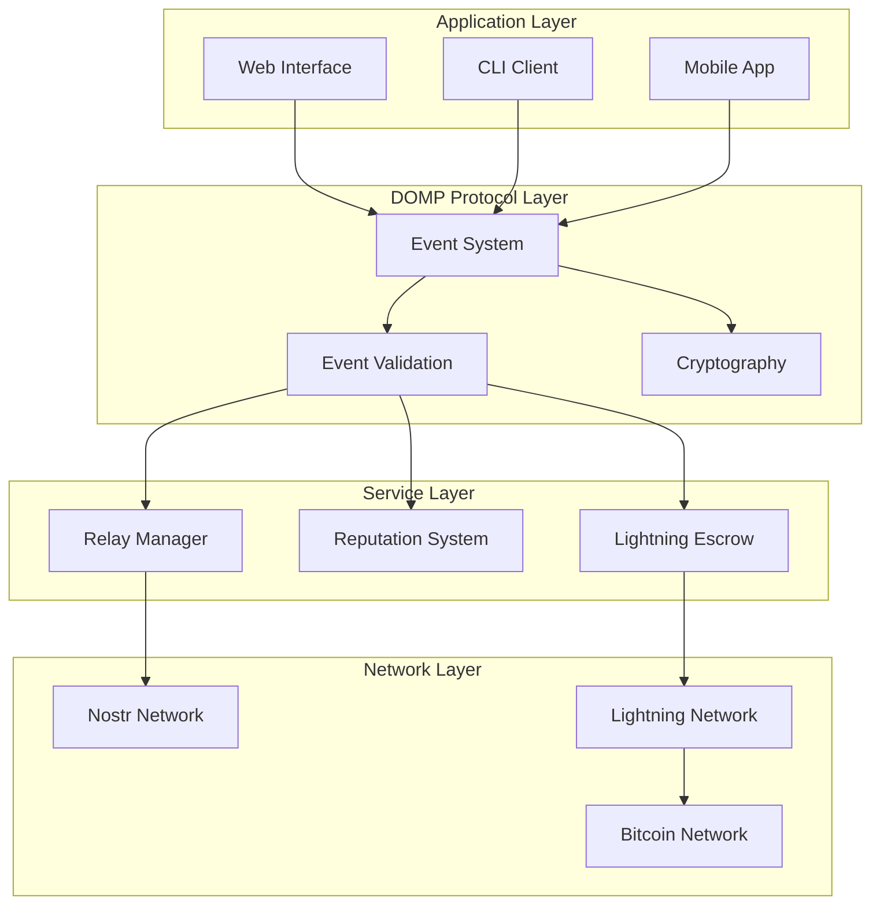
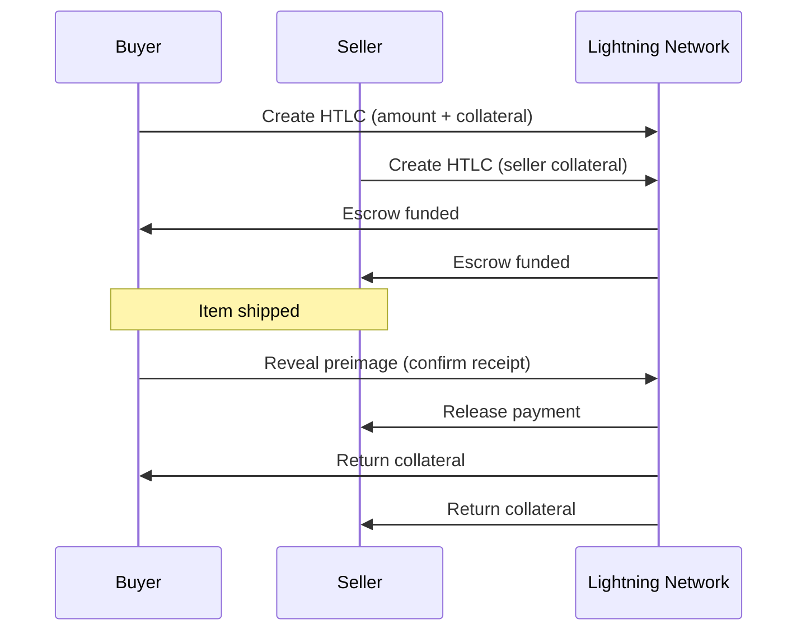

# DOMP Protocol Specification

Complete technical specification for the Decentralized Online Marketplace Protocol (DOMP).

## Table of Contents

- [Overview](#overview)
- [Architecture](#architecture)
- [Event Types](#event-types)
- [Cryptographic Specifications](#cryptographic-specifications)
- [Lightning Integration](#lightning-integration)
- [Reputation System](#reputation-system)
- [Network Protocol](#network-protocol)
- [Security Model](#security-model)
- [Implementation Guidelines](#implementation-guidelines)

## Overview

### Protocol Goals

DOMP is designed to enable trustless peer-to-peer commerce with the following objectives:

1. **Decentralization**: No central authority or single point of failure
2. **Trustless Transactions**: Cryptographic guarantees without trusted third parties  
3. **Censorship Resistance**: Utilizes the Nostr protocol for communication
4. **Bitcoin Integration**: Native Lightning Network support for payments
5. **Verifiable Reputation**: Cryptographically signed reputation system
6. **Extensibility**: Open protocol allowing multiple implementations

### Core Principles

- **Event-Driven Architecture**: All marketplace actions are represented as signed events
- **Cryptographic Verification**: Every action must be cryptographically verifiable
- **Atomic Transactions**: Payments are atomic via Lightning HTLCs
- **Decentralized Storage**: Events distributed across Nostr relay network
- **Open Source**: All implementations must be open source and auditable

## Architecture

### System Components



### Protocol Stack

| Layer | Purpose | Components |
|-------|---------|------------|
| Application | User Interfaces | Web, CLI, Mobile Apps |
| Protocol | DOMP Logic | Events, Validation, Cryptography |
| Service | Core Services | Lightning, Reputation, Relay Management |
| Network | Infrastructure | Nostr, Bitcoin, Lightning Network |

## Event Types

### Event Structure

All DOMP events follow the Nostr event format with specific `kind` values:

```typescript
interface DOMPEvent {
  id: string;         // Event hash (SHA-256)
  pubkey: string;     // Author's public key (hex)
  created_at: number; // Unix timestamp
  kind: number;       // Event type identifier
  content: string;    // JSON-encoded event data
  tags: string[][];   // Event tags for indexing
  sig: string;        // Schnorr signature (hex)
}
```

### Kind 300: Product Listing

Creates a new marketplace listing.

**Structure:**
```json
{
  "kind": 300,
  "content": "{
    \"product_name\": \"Digital Camera DSLR\",
    \"description\": \"Professional 24MP camera with lens\",
    \"price_satoshis\": 75000000,
    \"category\": \"electronics\",
    \"seller_collateral_satoshis\": 7500000,
    \"listing_id\": \"item_1703894400_1\",
    \"shipping_options\": [\"standard\", \"express\"],
    \"payment_methods\": [\"lightning\"],
    \"condition\": \"used_excellent\",
    \"location_hint\": \"US\",
    \"expires_at\": 1703980800
  }",
  "tags": [
    ["listing_id", "item_1703894400_1"],
    ["category", "electronics"],
    ["price_sats", "75000000"],
    ["location", "US"],
    ["expires", "1703980800"]
  ]
}
```

**Required Fields:**
- `product_name`: Human-readable product name
- `description`: Detailed product description  
- `price_satoshis`: Price in satoshis (integer)
- `seller_collateral_satoshis`: Seller collateral amount
- `listing_id`: Unique identifier for this listing

**Optional Fields:**
- `category`: Product category
- `shipping_options`: Available shipping methods
- `condition`: Item condition
- `location_hint`: General location for shipping estimates
- `expires_at`: Listing expiration timestamp

### Kind 301: Bid Submission

Buyer submits a purchase offer.

**Structure:**
```json
{
  "kind": 301,
  "content": "{
    \"product_ref\": \"item_1703894400_1\",
    \"bid_amount_satoshis\": 75000000,
    \"buyer_collateral_satoshis\": 75000000,
    \"message\": \"Interested in purchasing this camera\",
    \"payment_timeout_hours\": 24,
    \"shipping_address_hash\": \"sha256_hash_of_encrypted_address\",
    \"escrow_pubkey\": \"buyer_escrow_public_key\"
  }",
  "tags": [
    ["product_ref", "item_1703894400_1"],
    ["bid_amount", "75000000"],
    ["timeout", "24"]
  ]
}
```

**Required Fields:**
- `product_ref`: Reference to listing ID
- `bid_amount_satoshis`: Offered price in satoshis
- `buyer_collateral_satoshis`: Buyer collateral amount
- `payment_timeout_hours`: Time limit for payment

**Optional Fields:**
- `message`: Message to seller
- `shipping_address_hash`: Hash of encrypted shipping address
- `escrow_pubkey`: Dedicated escrow public key

### Kind 303: Bid Acceptance

Seller accepts a buyer's bid.

**Structure:**
```json
{
  "kind": 303,
  "content": "{
    \"bid_ref\": \"bid_event_id\",
    \"product_ref\": \"item_1703894400_1\",
    \"accepted_amount_satoshis\": 75000000,
    \"lightning_invoice\": \"lnbc750m1p...\",
    \"escrow_conditions\": {
      \"timeout_blocks\": 144,
      \"dispute_pubkey\": \"optional_arbitrator_key\"
    },
    \"shipping_eta_hours\": 72,
    \"tracking_method\": \"email_updates\"
  }",
  "tags": [
    ["bid_ref", "bid_event_id"],
    ["product_ref", "item_1703894400_1"],
    ["invoice", "lnbc750m1p..."],
    ["timeout", "144"]
  ]
}
```

**Required Fields:**
- `bid_ref`: Reference to accepted bid event
- `product_ref`: Reference to original listing
- `accepted_amount_satoshis`: Final agreed price
- `lightning_invoice`: Lightning payment invoice

**Optional Fields:**
- `escrow_conditions`: HTLC timeout and dispute handling
- `shipping_eta_hours`: Estimated shipping time
- `tracking_method`: How tracking info will be provided

### Kind 311: Payment Confirmation

Confirms Lightning payment completion.

**Structure:**
```json
{
  "kind": 311,
  "content": "{
    \"transaction_ref\": \"tx_bid_12345\",
    \"payment_hash\": \"lightning_payment_hash\",
    \"payment_preimage\": \"lightning_preimage\",
    \"amount_paid_satoshis\": 75000000,
    \"escrow_funded_at\": 1703894500,
    \"buyer_collateral_tx\": \"collateral_payment_hash\",
    \"seller_collateral_tx\": \"seller_collateral_hash\"
  }",
  "tags": [
    ["tx_ref", "tx_bid_12345"],
    ["payment_hash", "lightning_payment_hash"],
    ["amount", "75000000"]
  ]
}
```

**Required Fields:**
- `transaction_ref`: Reference to transaction ID
- `payment_hash`: Lightning payment hash
- `amount_paid_satoshis`: Amount actually paid
- `escrow_funded_at`: Timestamp when escrow was funded

### Kind 313: Receipt Confirmation

Buyer confirms receipt and provides rating.

**Structure:**
```json
{
  "kind": 313,
  "content": "{
    \"transaction_ref\": \"tx_bid_12345\",
    \"delivery_confirmed\": true,
    \"delivery_confirmed_at\": 1703897100,
    \"overall_rating\": 5,
    \"item_quality_rating\": 5,
    \"shipping_speed_rating\": 4,
    \"communication_rating\": 5,
    \"payment_reliability_rating\": 5,
    \"feedback_text\": \"Excellent condition, fast shipping!\",
    \"item_condition\": \"as_described\",
    \"would_buy_again\": true,
    \"preimage_reveal\": \"lightning_preimage_for_release\"
  }",
  "tags": [
    ["tx_ref", "tx_bid_12345"],
    ["rating", "5"],
    ["confirmed", "true"]
  ]
}
```

**Required Fields:**
- `transaction_ref`: Reference to transaction
- `delivery_confirmed`: Boolean confirmation of receipt
- `overall_rating`: Overall rating (1-5)

**Optional Fields:**
- `item_quality_rating`: Specific quality rating
- `shipping_speed_rating`: Shipping speed rating
- `communication_rating`: Seller communication rating
- `feedback_text`: Written feedback
- `preimage_reveal`: Lightning preimage to release escrow

## Cryptographic Specifications

### Key Generation

DOMP uses secp256k1 keypairs compatible with Bitcoin and Nostr:

```python
# Key generation
import secrets
import secp256k1

# Generate private key
private_key = secrets.randbits(256).to_bytes(32, 'big')

# Derive public key
public_key = secp256k1.PublicKey.from_secret(private_key)
public_key_hex = public_key.serialize().hex()
```

### Event Signing

Events are signed using Schnorr signatures:

```python
def sign_event(event_dict: dict, private_key: bytes) -> str:
    """Sign DOMP event with Schnorr signature"""
    
    # Create message to sign
    message = create_event_message(event_dict)
    message_hash = hashlib.sha256(message.encode()).digest()
    
    # Sign with Schnorr
    signature = schnorr_sign(message_hash, private_key)
    return signature.hex()

def create_event_message(event: dict) -> str:
    """Create canonical message for signing"""
    return json.dumps([
        0,  # Reserved for future use
        event['pubkey'],
        event['created_at'], 
        event['kind'],
        event['tags'],
        event['content']
    ], separators=(',', ':'), ensure_ascii=False)
```

### Event Verification

```python
def verify_event(event_dict: dict) -> bool:
    """Verify event signature and structure"""
    
    # Check required fields
    required = ['id', 'pubkey', 'created_at', 'kind', 'content', 'sig']
    if not all(field in event_dict for field in required):
        return False
    
    # Verify event ID
    message = create_event_message(event_dict)
    expected_id = hashlib.sha256(message.encode()).hexdigest()
    if event_dict['id'] != expected_id:
        return False
    
    # Verify signature
    message_hash = hashlib.sha256(message.encode()).digest()
    return schnorr_verify(
        message_hash,
        bytes.fromhex(event_dict['sig']),
        bytes.fromhex(event_dict['pubkey'])
    )
```

### Proof of Work (Anti-Spam)

DOMP implements optional Proof of Work for spam prevention:

```python
def generate_pow_nonce(event_content: str, difficulty: int = 20) -> str:
    """Generate PoW nonce for event"""
    target = 2**(256 - difficulty)
    nonce = 0
    
    while True:
        test_content = f"{event_content}:{nonce}"
        hash_value = int(hashlib.sha256(test_content.encode()).hexdigest(), 16)
        
        if hash_value < target:
            return str(nonce)
        
        nonce += 1

def verify_pow(event_content: str, nonce: str, difficulty: int = 20) -> bool:
    """Verify PoW nonce"""
    target = 2**(256 - difficulty)
    test_content = f"{event_content}:{nonce}"
    hash_value = int(hashlib.sha256(test_content.encode()).hexdigest(), 16)
    return hash_value < target
```

## Lightning Integration

### HTLC Escrow Mechanism

DOMP uses Hash Time-Locked Contracts (HTLCs) for trustless escrow:



### Escrow States

```python
from enum import Enum

class EscrowState(Enum):
    PENDING = "pending"           # Escrow created, awaiting funding
    FUNDED = "funded"             # Both parties funded
    PAYMENT_SENT = "payment_sent" # Buyer payment confirmed
    COMPLETED = "completed"       # Escrow released successfully
    EXPIRED = "expired"           # Escrow timed out
    DISPUTED = "disputed"         # Dispute initiated
    REFUNDED = "refunded"         # Funds returned to parties
```

### Lightning Invoice Format

Standard Lightning invoices are used with DOMP-specific metadata:

```json
{
  "bolt11": "lnbc750m1p3xnhl2pp5...",
  "payment_hash": "64-char-hex",
  "amount_msat": 75000000000,
  "description": "DOMP escrow: item_1703894400_1",
  "expires_at": 1703898000,
  "route_hints": [],
  "domp_metadata": {
    "transaction_id": "tx_bid_12345",
    "listing_ref": "item_1703894400_1",
    "escrow_type": "purchase_payment"
  }
}
```

### Timeout Handling

```python
def calculate_escrow_timeout(shipping_eta_hours: int) -> int:
    """Calculate HTLC timeout in blocks"""
    # Base timeout: 24 hours (144 blocks)
    base_timeout = 144
    
    # Add shipping time + 48 hour buffer
    shipping_blocks = (shipping_eta_hours + 48) * 6  # 6 blocks/hour average
    
    # Minimum 144 blocks, maximum 2016 blocks (2 weeks)
    return max(144, min(2016, base_timeout + shipping_blocks))

def handle_escrow_timeout(escrow_id: str):
    """Handle escrow timeout"""
    escrow = get_escrow(escrow_id)
    
    if escrow.state == EscrowState.FUNDED:
        # Initiate dispute resolution
        initiate_dispute(escrow_id)
    elif escrow.state == EscrowState.PAYMENT_SENT:
        # Automatic refund after timeout
        refund_escrow(escrow_id)
```

## Reputation System

### Scoring Algorithm

DOMP uses a sophisticated reputation algorithm with multiple factors:

```python
def calculate_reputation_score(
    scores: List[ReputationScore],
    current_time: int
) -> float:
    """Calculate weighted reputation score"""
    
    if not scores:
        return 0.0
    
    total_weight = 0.0
    weighted_sum = 0.0
    
    for score in scores:
        # Time decay factor (scores lose weight over time)
        age_days = (current_time - score.created_at) / 86400
        time_weight = math.exp(-age_days / 365)  # Half-life of 1 year
        
        # Transaction volume weight (larger transactions matter more)
        volume_weight = math.log10(max(1, score.transaction_amount_sats / 100000))
        
        # Verification bonus
        verification_bonus = 1.0
        if score.verified_purchase:
            verification_bonus += 0.2
        if score.escrow_completed:
            verification_bonus += 0.3
        
        # Combined weight
        weight = time_weight * volume_weight * verification_bonus
        
        # Add to weighted average
        weighted_sum += score.overall_rating * weight
        total_weight += weight
    
    return weighted_sum / total_weight if total_weight > 0 else 0.0
```

### Trust Score Calculation

```python
def calculate_trust_score(
    reputation_summary: dict,
    network_metrics: dict
) -> float:
    """Calculate overall trust score (0-1)"""
    
    # Base reputation score (0-1)
    base_score = reputation_summary.get('overall_score', 0.0) / 5.0
    
    # Transaction volume factor
    total_volume_btc = reputation_summary.get('total_volume_btc', 0.0)
    volume_factor = min(1.0, total_volume_btc / 10.0)  # Cap at 10 BTC
    
    # Transaction count factor
    tx_count = reputation_summary.get('total_transactions', 0)
    count_factor = min(1.0, tx_count / 50.0)  # Cap at 50 transactions
    
    # Reviewer diversity factor
    unique_reviewers = reputation_summary.get('unique_reviewers', 0)
    diversity_factor = min(1.0, unique_reviewers / 20.0)  # Cap at 20 reviewers
    
    # Verification factor
    verified_ratio = (
        reputation_summary.get('verified_purchases', 0) /
        max(1, tx_count)
    )
    
    # Weighted combination
    trust_score = (
        base_score * 0.4 +
        volume_factor * 0.2 +
        count_factor * 0.2 +
        diversity_factor * 0.1 +
        verified_ratio * 0.1
    )
    
    return min(1.0, trust_score)
```

### Reputation Aggregation

```python
def aggregate_reputation_across_relays(
    pubkey: str,
    relay_connections: List[RelayConnection]
) -> dict:
    """Aggregate reputation from multiple relays"""
    
    all_scores = []
    relay_weights = {}
    
    for relay in relay_connections:
        # Fetch reputation events from relay
        scores = fetch_reputation_events(relay, pubkey)
        
        # Calculate relay weight based on network size and reputation
        weight = calculate_relay_weight(relay)
        relay_weights[relay.url] = weight
        
        # Add weighted scores
        for score in scores:
            score.relay_weight = weight
            all_scores.append(score)
    
    # Remove duplicates (same transaction from multiple relays)
    unique_scores = deduplicate_scores(all_scores)
    
    # Calculate aggregated reputation
    return calculate_reputation_score(unique_scores, int(time.time()))
```

## Network Protocol

### Nostr Integration

DOMP leverages the Nostr protocol for event distribution:

```python
class NostrDOMPClient:
    def __init__(self, relays: List[str]):
        self.relays = relays
        self.connections = {}
    
    async def connect_to_relays(self):
        """Connect to all configured relays"""
        for relay_url in self.relays:
            try:
                ws = await websockets.connect(relay_url)
                self.connections[relay_url] = ws
            except Exception as e:
                logger.warning(f"Failed to connect to {relay_url}: {e}")
    
    async def publish_event(self, event: dict):
        """Publish DOMP event to all relays"""
        message = ["EVENT", event]
        
        for relay_url, ws in self.connections.items():
            try:
                await ws.send(json.dumps(message))
            except Exception as e:
                logger.error(f"Failed to publish to {relay_url}: {e}")
    
    async def subscribe_domp_events(self, callback):
        """Subscribe to DOMP marketplace events"""
        subscription_id = f"domp_{int(time.time())}"
        
        # Filter for DOMP event kinds
        filter_obj = {
            "kinds": [300, 301, 303, 311, 313],
            "limit": 1000
        }
        
        message = ["REQ", subscription_id, filter_obj]
        
        for relay_url, ws in self.connections.items():
            try:
                await ws.send(json.dumps(message))
            except Exception as e:
                logger.error(f"Failed to subscribe to {relay_url}: {e}")
        
        # Handle incoming events
        await self._handle_subscription_events(callback)
```

### Event Filtering

```python
def create_domp_filters() -> List[dict]:
    """Create Nostr filters for DOMP events"""
    
    return [
        # Product listings
        {
            "kinds": [300],
            "limit": 100,
            "#category": ["electronics", "computers", "books"],
            "since": int(time.time()) - 86400  # Last 24 hours
        },
        
        # Bids and transactions
        {
            "kinds": [301, 303, 311, 313],
            "limit": 50,
            "since": int(time.time()) - 3600  # Last hour
        },
        
        # Reputation events
        {
            "kinds": [313],  # Receipt confirmations contain ratings
            "limit": 200,
            "since": int(time.time()) - 604800  # Last week
        }
    ]
```

### Relay Selection

```python
def select_optimal_relays(
    available_relays: List[str],
    requirements: dict
) -> List[str]:
    """Select optimal relays for DOMP operations"""
    
    relay_scores = {}
    
    for relay_url in available_relays:
        score = 0.0
        
        # Test connectivity and latency
        latency = test_relay_latency(relay_url)
        if latency < 100:  # ms
            score += 3.0
        elif latency < 500:
            score += 1.0
        
        # Check relay policies
        info = get_relay_info(relay_url)
        if info.get('supports_nip09'):  # Event deletion
            score += 1.0
        if info.get('supports_nip11'):  # Relay metadata
            score += 0.5
        
        # Geographic diversity
        region = get_relay_region(relay_url)
        if region in requirements.get('preferred_regions', []):
            score += 2.0
        
        # Network size and activity
        activity_score = estimate_relay_activity(relay_url)
        score += min(2.0, activity_score)
        
        relay_scores[relay_url] = score
    
    # Select top relays
    sorted_relays = sorted(
        relay_scores.items(),
        key=lambda x: x[1],
        reverse=True
    )
    
    return [url for url, score in sorted_relays[:5]]  # Top 5 relays
```

## Security Model

### Threat Analysis

| Threat | Impact | Mitigation |
|--------|--------|------------|
| Sybil Attacks | High | PoW requirements, reputation weighting |
| Eclipse Attacks | Medium | Multiple relay connections |
| Replay Attacks | Medium | Event timestamps, unique IDs |
| Man-in-the-Middle | High | WebSocket TLS, signature verification |
| Front-running | Low | Encrypted bid details |
| Escrow Theft | High | Multi-sig HTLCs, timeout mechanisms |

### Security Properties

1. **Event Integrity**: All events are cryptographically signed
2. **Non-repudiation**: Signatures provide proof of authorship
3. **Censorship Resistance**: Distributed across multiple relays
4. **Payment Atomicity**: HTLCs ensure atomic payment delivery
5. **Privacy**: Optional encrypted fields, pseudonymous identities

### Attack Vectors and Defenses

#### Sybil Reputation Farming
```python
def detect_sybil_reputation(scores: List[ReputationScore]) -> float:
    """Detect potential Sybil attacks in reputation scores"""
    
    # Check for clustering of review timestamps
    timestamps = [score.created_at for score in scores]
    timestamp_clusters = detect_time_clusters(timestamps)
    
    # Check for small transaction amounts (farming)
    small_tx_ratio = sum(
        1 for score in scores 
        if score.transaction_amount_sats < 1_000_000  # < 0.01 BTC
    ) / len(scores)
    
    # Check reviewer diversity
    reviewers = [score.reviewer_pubkey for score in scores]
    unique_ratio = len(set(reviewers)) / len(reviewers)
    
    # Calculate suspicion score
    suspicion = (
        len(timestamp_clusters) * 0.3 +
        small_tx_ratio * 0.4 +
        (1 - unique_ratio) * 0.3
    )
    
    return min(1.0, suspicion)
```

#### Front-running Prevention
```python
def create_sealed_bid(
    listing_id: str,
    bid_amount: int,
    buyer_keypair: KeyPair,
    reveal_time: int
) -> dict:
    """Create sealed bid to prevent front-running"""
    
    # Create bid commitment
    bid_data = {
        "listing_id": listing_id,
        "bid_amount_sats": bid_amount,
        "buyer_pubkey": buyer_keypair.public_key_hex,
        "reveal_time": reveal_time,
        "salt": secrets.token_hex(32)
    }
    
    bid_json = json.dumps(bid_data, sort_keys=True)
    commitment = hashlib.sha256(bid_json.encode()).hexdigest()
    
    # Create sealed bid event
    sealed_bid = {
        "kind": 30001,  # Custom sealed bid event
        "content": json.dumps({
            "listing_ref": listing_id,
            "bid_commitment": commitment,
            "reveal_time": reveal_time
        }),
        "tags": [
            ["listing_ref", listing_id],
            ["reveal_time", str(reveal_time)]
        ]
    }
    
    return sealed_bid, bid_data
```

## Implementation Guidelines

### Client Requirements

#### Mandatory Features
1. **Event Validation**: Must validate all incoming events
2. **Signature Verification**: Must verify all event signatures
3. **Relay Connectivity**: Must connect to multiple relays
4. **Lightning Integration**: Must support Lightning payments
5. **Identity Management**: Must securely manage keypairs

#### Recommended Features
1. **Reputation Display**: Show seller reputation scores
2. **Event Caching**: Cache events for performance
3. **Offline Support**: Queue events when offline
4. **Multi-language**: Support multiple languages
5. **Accessibility**: Follow accessibility guidelines

### Relay Requirements

#### Mandatory Support
1. **Event Storage**: Store DOMP events (kinds 300-313)
2. **Event Filtering**: Support filtering by kind, tags, time
3. **WebSocket Protocol**: Implement Nostr WebSocket API
4. **Event Broadcasting**: Broadcast events to subscribers

#### Optional Features
1. **Event Deletion**: Support NIP-09 event deletion
2. **Rate Limiting**: Implement rate limiting for abuse prevention
3. **Paid Relays**: Support paid relay models
4. **Content Filtering**: Filter inappropriate content

### Testing Requirements

#### Unit Tests
```python
def test_event_validation():
    """Test event structure validation"""
    # Valid event
    event = create_test_listing()
    assert validate_event(event.to_dict())
    
    # Invalid signature
    event_dict = event.to_dict()
    event_dict['sig'] = 'invalid'
    assert not validate_event(event_dict)

def test_reputation_calculation():
    """Test reputation scoring"""
    scores = create_test_reputation_scores()
    rating = calculate_reputation_score(scores, int(time.time()))
    assert 0.0 <= rating <= 5.0

def test_lightning_escrow():
    """Test Lightning escrow creation"""
    escrow = create_test_escrow()
    assert escrow.state == EscrowState.PENDING
    
    fund_escrow(escrow)
    assert escrow.state == EscrowState.FUNDED
```

#### Integration Tests
```python
async def test_full_transaction_flow():
    """Test complete transaction from listing to completion"""
    
    # Setup
    seller = KeyPair()
    buyer = KeyPair()
    
    # Create listing
    listing = create_listing(seller, "Test Item", 1_000_000)
    await publish_event(listing)
    
    # Submit bid
    bid = create_bid(buyer, listing.id, 1_000_000)
    await publish_event(bid)
    
    # Accept bid
    acceptance = accept_bid(seller, bid.id)
    await publish_event(acceptance)
    
    # Create escrow
    escrow = create_escrow(listing, bid, acceptance)
    assert escrow.state == EscrowState.FUNDED
    
    # Confirm receipt
    receipt = confirm_receipt(buyer, escrow.transaction_id, 5)
    await publish_event(receipt)
    
    # Verify completion
    assert escrow.state == EscrowState.COMPLETED
```

### Performance Guidelines

#### Event Processing
- Validate events asynchronously
- Cache validation results
- Use connection pooling for relays
- Implement backpressure for high event volumes

#### Memory Management
- Limit event cache size
- Implement TTL for cached data
- Use weak references where appropriate
- Monitor memory usage

#### Network Optimization
- Use WebSocket connection pooling
- Implement exponential backoff for retries
- Compress large payloads
- Batch event operations

---

This protocol specification provides the technical foundation for implementing DOMP-compatible applications. For practical implementation examples, see the [Developer Guide](DEVELOPER_GUIDE.md) and [API Documentation](API.md).